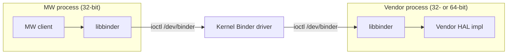

# Linux Binder Build Guide

## Build Structure

This repository provides **two separate builds**:

1. **Host Tools** (`out/host/`) - AIDL compiler tools for code generation
2. **Target Libraries** (`out/target/`) - Binder runtime libraries for embedded devices

```bash
out/
├── host/              # Host tools (x86_64 build machine)
│   └── bin/
│       ├── aidl       # AIDL compiler
│       └── aidl-cpp   # C++ AIDL compiler
└── target/            # Target libraries (ARM/device architecture)
    ├── bin/
    │   └── servicemanager
    ├── lib/
    │   ├── libbinder.so
    │   ├── liblog.so
    │   └── ...
    └── include/       # Binder headers
```

## Prerequisites

- Ubuntu 22.04 LTS (or similar)
- CMake 3.22.1 or later
- GCC 11.2.0 or later (GCC 9.4.0 minimum)
- For cross-compilation: ARM toolchain (e.g., `arm-linux-gnueabihf-gcc`)

## Building Host Tools

Host tools run on your **build machine** (typically x86_64) to generate code from AIDL interfaces.

```bash
./build-aidl-generator-tool.sh

# Clean build (removes build-host/ and out/host/ first)
./build-aidl-generator-tool.sh --clean

# Show help
./build-aidl-generator-tool.sh --help
```

**Output:**

- `out/host/bin/aidl` - AIDL compiler
- `out/host/bin/aidl-cpp` - C++ AIDL compiler

**Compiler Selection:**
Uses system default `gcc/g++`. Override if needed with `HOST_CC`/`HOST_CXX`:

```bash
export HOST_CC=gcc-11
export HOST_CXX=g++-11
./build-aidl-generator-tool.sh
```

## Building Target Libraries

Target libraries run on your **embedded device** (typically ARM).

### Native Build (x86_64 target)

For local testing or x86_64 targets using system GCC:

```bash
./build-linux-binder-aidl.sh

# Clean build (removes build-target/ and out/target/ first)
./build-linux-binder-aidl.sh clean

# Show help
./build-linux-binder-aidl.sh help
```

**Note:**
- This script builds the host AIDL generator tool by default so the target build can generate stubs/proxies.
- Use `no-host-aidl` if you already have `out/host/bin/aidl` available.
- When CC/CXX are **not set**, CMake automatically uses system compiler (gcc/g++ from build-essential).

### Cross-Compilation (ARM target)

For ARM embedded devices with cross-compiler and sysroot:

```bash
export CC=arm-linux-gnueabihf-gcc
export CXX=arm-linux-gnueabihf-g++
export CFLAGS="--sysroot=/path/to/sysroot -march=armv7-a -mfpu=neon"
export CXXFLAGS="--sysroot=/path/to/sysroot -march=armv7-a -mfpu=neon"
export LDFLAGS="--sysroot=/path/to/sysroot"
export TARGET_BITNESS=32            # optional: assert the toolchain is 32-bit
./build-linux-binder-aidl.sh
```

**Note:** The script respects all standard Yocto environment variables:
- `CC` / `CXX` - Cross-compiler toolchain
- `CFLAGS` / `CXXFLAGS` - Compiler flags (sysroot, architecture-specific flags)
- `LDFLAGS` - Linker flags (sysroot, library paths)

These are automatically passed to CMake as `CMAKE_C_COMPILER`, `CMAKE_CXX_COMPILER`, `CMAKE_C_FLAGS`, `CMAKE_CXX_FLAGS`, and `CMAKE_*_LINKER_FLAGS`.

**Output:**

- `out/target/lib/libbinder.so` - Core binder library
- `out/target/lib/liblog.so`, `libbase.so`, etc. - Support libraries
- `out/target/bin/servicemanager` - Binder service manager
- `out/target/include/` - Headers for building binder clients/services

## Build Options

### Environment Variables

| Variable | Description | Default |
|----------|-------------|---------|
| `CC` | C compiler | System default |
| `CXX` | C++ compiler | System default |
| `CFLAGS` | C compiler flags (sysroot, arch flags) | None |
| `CXXFLAGS` | C++ compiler flags | None |
| `LDFLAGS` | Linker flags | None |
| `BUILD_TYPE` | `Debug` or `Release` | `Release` |
| `TARGET_BITNESS` | Declare the target ELF class: `32` or `64` | follows the toolchain |
| `BINDER_PROTOCOL` | Binder wire protocol: `7` or `8` | `8`, on every toolchain |

#### Deprecated spellings

Still honoured, so an existing recipe keeps working. New builds use the
switches above.

| Deprecated | Write instead | Why it was replaced |
|------------|---------------|---------------------|
| `TARGET_LIB32_VERSION=ON` | `TARGET_BITNESS=32` | "VERSION" suggests a version number, and two booleans for one binary fact can disagree with each other |
| `TARGET_LIB64_VERSION=ON` | `TARGET_BITNESS=64` | as above |
| `BINDER_IPC_32BIT=ON` | `BINDER_PROTOCOL=7` | it names the legacy mode rather than the protocol, so it reads backwards — `OFF` means protocol 8 |
| `BINDER_IPC_32BIT=OFF` | `BINDER_PROTOCOL=8` | as above |

Passing a deprecated spelling alongside its replacement is a configure error
when the two disagree, so a half-converted recipe stops rather than silently
picking one.

`BINDER_IPC_32BIT` survives as the **compile define** and as the kernel's
Kconfig symbol — `CONFIG_ANDROID_BINDER_IPC_32BIT`, and the `#ifdef` in
`linux/android/binder.h` that sets `binder_size_t`'s width. Only its use as a
build switch is deprecated.

### Examples

**Native build (system GCC):**

```bash
# Uses system default gcc/g++ - no environment variables needed
./build-linux-binder-aidl.sh
```

**Debug build for host tools:**

```bash
BUILD_TYPE=Debug ./build-aidl-generator-tool.sh
```

**Cross-compile: 32-bit ARM target with sysroot:**

```bash
export CC=arm-linux-gnueabihf-gcc
export CXX=arm-linux-gnueabihf-g++
export CFLAGS="--sysroot=/opt/poky/sysroots/armv7ahf-neon -march=armv7-a"
export CXXFLAGS="--sysroot=/opt/poky/sysroots/armv7ahf-neon -march=armv7-a"
export LDFLAGS="--sysroot=/opt/poky/sysroots/armv7ahf-neon"
export TARGET_BITNESS=32
./build-linux-binder-aidl.sh
```

## Integration with Yocto/Bitbake

### Production Build (CMake Direct)

**Production build systems (Yocto/BitBake) MUST call CMake directly** with explicit variables. The wrapper scripts (`build-*.sh`) are convenience tools for developers and architecture team members only - they are NOT suitable for production recipes.

**Production builds only require TARGET libraries** - the AIDL compiler is used offline by the architecture team (using `./build-aidl-generator-tool.sh` for convenience) to generate interface code, which is then committed to the repository.

**BitBake Recipe Example** — this is `example/yocto/linux-binder.bb`, kept
in the repository so you can copy or diff it rather than retype it.
`tests/test_yocto_recipe_example.sh` fails if this block and that file
disagree, so the two cannot drift apart:

```bitbake
# files/ sits beside this recipe and holds the systemd unit. Without this a
# layer that copies only the .bb fails during fetch, before anything builds.
FILESEXTRAPATHS:prepend := "${THISDIR}/files:"

SRC_URI = "${RDKCENTRAL_GITHUB_ROOT}/linux_binder_idl;${RDKCENTRAL_GITHUB_SRC_URI_SUFFIX}"
SRC_URI += "file://servicemanager.service"

# Pin to a released tag. A branch name or a feature-branch SHA makes the build
# unreproducible and is not a supported configuration.
PV ?= "2.6.0"
SRCREV ?= "2.6.0"
S = "${WORKDIR}/git"

# libbinder provides liblog; do not also build liblog.bb.
RPROVIDES:${PN}:append = " liblog"
PROVIDES:append = " liblog"

inherit cmake systemd siteinfo

# The wire protocol belongs to the kernel, so the recipe needs the configured
# kernel in scope to read it.
do_configure[depends] += "virtual/kernel:do_shared_workdir"

# Protocol 8, on every platform. It is what every 64-bit kernel serves, what
# every kernel from 4.18 serves, and what a 32-bit userspace runs perfectly well
# - it needs 64-bit FIELDS, not a 64-bit anything. Protocol 7 is legacy
# compatibility, for a 32-bit kernel at 4.17 or older that still carries
# CONFIG_ANDROID_BINDER_IPC_32BIT.
#
# The ELF class is NOT passed. It follows CC/CXX, which the toolchain already
# sets, and nothing in the build can change it - so declaring it would only
# restate what the compiler already says. Add -DTARGET_BITNESS=${SITEINFO_BITS}
# if you want the build to STOP when the toolchain is not the bitness this
# recipe is being built for; it is an assertion, not a setting.
#
# If your fleet still has protocol-7 platforms, or you want a kernel drifting
# back to protocol 7 to fail the BUILD rather than the device, derive it instead:
#
#     require binder-protocol-from-kernel.inc
#     EXTRA_OECMAKE += " -DBINDER_PROTOCOL=${BINDER_PROTOCOL_RESOLVED}"
#
EXTRA_OECMAKE += " \
    -DBUILD_HOST_AIDL=OFF \
    -DBINDER_PROTOCOL=8 \
"

do_install:append() {
    install -d ${D}${systemd_unitdir}/system
    install -m 0644 ${WORKDIR}/servicemanager.service ${D}${systemd_unitdir}/system
}

SYSTEMD_SERVICE:${PN} = "servicemanager.service"
SYSTEMD_AUTO_ENABLE = "enable"

# These libraries are UNVERSIONED - the SDK ships a plain libbinder.so, with no
# SONAME and no libbinder.so.1 beside it. That matters for packaging: OE's
# default -dev FILES claim ${libdir}/lib*.so, and -dev is ordered BEFORE ${PN}
# in PACKAGES, so -dev takes the real objects and do_package_qa rejects them:
#
#   QA Issue: -dev package libbinder-dev contains non-symlink .so
#             '/usr/lib/libbinder.so' [dev-elf]
#
# So -dev is ASSIGNED rather than appended, dropping the default .so glob. The
# runtime package keeps the libraries, which is correct - unversioned, they are
# the runtime artifact, not a development symlink. Consumers still link against
# them because do_populate_sysroot stages from ${D}, not from the -dev package.
FILES:${PN} += "${libdir}/lib*.so*"
FILES:${PN}-dev = "${includedir}/*"
```

### Which row is your platform?

The recipe above states protocol 8 and lets bitness follow the cross-toolchain,
which is right on every supported platform. There are three configurations in
all, and the row below tells you whether yours is one the recipe already covers.
Bitness is a property of the role; the wire protocol is a property of the
platform — there is one kernel, so it serves one protocol, and every role on the
device speaks that one.

| | The kernel it matches | Protocol switch | ELF class |
| --- | ------ | -------- | --- |
| **A** — legacy all-32-bit | a 32-bit kernel whose resolved config has `CONFIG_ANDROID_BINDER_IPC_32BIT=y` | `-DBINDER_PROTOCOL=7` | from a 32-bit toolchain |
| **B** — 32-bit userspace on a protocol-8 kernel | every other 32-bit userspace: a 32-bit kernel with that symbol unset or absent, and 32-bit middleware on a 64-bit kernel | `-DBINDER_PROTOCOL=8` | from a 32-bit toolchain |
| **C** — 64-bit userspace | any 64-bit kernel | `-DBINDER_PROTOCOL=8` | from a 64-bit toolchain |

Only row A differs from what the recipe above already does. The ELF class has
its own column because it is not a switch: point the build at the right
cross-compiler and it follows. `-DTARGET_BITNESS=32|64` can be added to assert
it, for a build that should stop when the toolchain is not what was expected.

To derive the protocol from the kernel instead of stating it — for a fleet that
still has row A in it — see
[Deriving the protocol from the kernel](#deriving-the-protocol-from-the-kernel)
above.

**The kernel version does not decide the row — its config does.** Being 32-bit
at 4.17 or older is what makes protocol 7 *possible*; it is not what makes it
apply. The derivation in the recipe above reads the resolved `.config` for
exactly this reason, and there are three states to read, not two:

| In the kernel config | Protocol | Row |
| -------------------- | -------- | --- |
| `CONFIG_ANDROID_BINDER_IPC_32BIT=y` | 7 | A |
| `# CONFIG_ANDROID_BINDER_IPC_32BIT is not set` | 8 | B |
| the symbol absent entirely | 8 | B |

The third state is common: a vendor BSP that backports a newer binder driver
onto an older base drops the option altogether, so the symbol does not exist
even on a 4.9 kernel. A 32-bit 4.9 platform is therefore as likely to be row B
as row A, and only its config says which. Two devices on the same silicon and
the same 4.9 kernel version can sit in different rows.

**Row A is the one that must state its switch.** Protocol 8 is the default on
every toolchain, so rows B and C are what a build inherits without asking. A
legacy platform is the exception and passes `-DBINDER_PROTOCOL=7` explicitly.
Protocol 8 carries 64-bit wire *fields*, which a 32-bit process fills by
zero-extension — it is the mixed-capable protocol, not the 64-bit protocol.

**On a 64-bit kernel two SDKs ship** — a 32-bit one for the middleware and a
64-bit one for the vendor: different ELF classes, both protocol 8, because both
talk to the same kernel.

A protocol mismatch is not caught at build time. It surfaces on the device, where
every binder process terminates at startup. [`PROTOCOL.md`](PROTOCOL.md) carries
the full matrix, the kernel-version derivation and the verification steps.

#### Deriving the protocol from the kernel

The recipe above states protocol 8 because every supported platform serves it.
Two situations want the protocol worked out from the kernel instead:

- a fleet that still has protocol-7 platforms in it, where one recipe has to
  serve both
- wanting a kernel that **drifts back** to protocol 7 — someone re-adding the
  Kconfig patch, say — to fail the **build** rather than produce a device on
  which every binder process dies at startup

`example/yocto/binder-protocol-from-kernel.inc` does that. Use it with:

```bitbake
require binder-protocol-from-kernel.inc
EXTRA_OECMAKE += " -DBINDER_PROTOCOL=${BINDER_PROTOCOL_RESOLVED}"
```

It reads the kernel's **resolved** `.config` at
`${STAGING_KERNEL_BUILDDIR}/.config`, pulling the configured kernel into scope
with `do_configure[depends] += "virtual/kernel:do_shared_workdir"`. Never the
defconfig: a defconfig can request a symbol the kernel's Kconfig no longer has,
and the request is dropped in silence, so it can claim protocol 7 while the
kernel it produced serves protocol 8.

`BINDER_PROTOCOL` remains available for a build with no kernel in scope, an SDK
for instance. Given both a kernel and a declared value, they must agree — a
disagreement is fatal rather than one quietly winning.

The resolved answer is readable without running a task:

```sh
bitbake -e linux-binder | grep ^BINDER_PROTOCOL_RESOLVED
```

**Key Points:**

- **The protocol is stated, because there is one**: every supported platform is
  protocol 8, so the recipe says `-DBINDER_PROTOCOL=8` and there is nothing to
  work out. See *Deriving the protocol from the kernel* below for the fleets
  that still need the other thing
- **`SITEINFO_BITS`, not `TUNE_FEATURES`**: it is the target's word size directly, so it covers every
  64-bit architecture rather than matching on one of them, and it is multilib-aware
- **Production builds**: Only build target runtime libraries. `BUILD_HOST_AIDL` is `OFF` by default,
  so a recipe gets the production path without asking for it; the line above states it anyway,
  because a build spec states its switches
- **No AIDL compiler needed**: Architecture team generates C++ code offline using AIDL compiler
- **Pre-generated code committed**: All AIDL-generated C++ files are in source control
- **No code generation at build time**: Production builds compile pre-generated C++ only
- **Servicemanager startup**: Systemd service auto-starts on boot via `SYSTEMD_AUTO_ENABLE`

### CMake Variables Reference

**When to use what:**
- **Production (Yocto/BitBake)**: Call CMake directly with explicit variables (documented below)
- **Development/Architecture Team**: Use wrapper scripts for convenience (see [Manual/Development Build](#manualdevelopment-build-wrapper-scripts) section)

The following tables list CMake variables for **direct CMake invocation in production build systems**. Wrapper scripts handle these automatically - developers and architecture team members do NOT need to configure these manually.

#### Required Configuration Variables

| Variable | Description | Default | Required? |
|----------|-------------|---------|-----------|
| `BUILD_HOST_AIDL` | Build host AIDL compiler (architecture team only) | `OFF` | Optional - already `OFF`; a production spec states it anyway |

#### Wire protocol and target bitness

| Variable | Description | Default | Notes |
|----------|-------------|---------|-------|
| `BINDER_PROTOCOL` | Binder wire protocol: `7` or `8` | `8`, on every toolchain | Must match the target kernel |
| `TARGET_BITNESS` | Declare the target ELF class: `32` or `64` | follows the toolchain | Optional assertion; most builds omit it |

The deprecated spellings of both — `BINDER_IPC_32BIT` and the
`TARGET_LIB32_VERSION` / `TARGET_LIB64_VERSION` pair — are listed under
[Deprecated spellings](#deprecated-spellings).

**The ELF class comes from your compiler, not from a switch.** `TARGET_BITNESS`
adds no `-m32` / `-m64` and cannot select anything: it *declares* what the
toolchain is meant to be, and the build stops if `CC` / `CXX` disagrees. Pass it
when you want a cross-compile that silently fell back to the host compiler to
fail; leave it out otherwise, and bitness simply follows `CC` / `CXX` (or the
Yocto toolchain).

**These are two independent axes:**

- `TARGET_BITNESS` declares the **target ABI**, and follows your *userspace* architecture.
- `BINDER_PROTOCOL` selects the **binder wire protocol**, and follows the *kernel's* `CONFIG_ANDROID_BINDER_IPC_32BIT`.

**The protocol default is 8 on every toolchain, and bitness does not move it.**
The same 32-bit toolchain is correct at protocol 7 on a legacy kernel and wrong
at it everywhere else, so a toolchain-derived default has to be wrong somewhere.
Defaulting to 8 puts the silent answer where every supported platform already
is, and leaves the legacy build as the one that must state
`-DBINDER_PROTOCOL=7`.

**Protocol 7 requires a 32-bit toolchain.** It carries 32-bit binder handles, so a 64-bit pointer model cannot be represented in them — and no 64-bit kernel serves protocol 7 in any case (`CONFIG_ANDROID_BINDER_IPC_32BIT` is `depends on !64BIT` upstream). The two valid pairings are therefore:

| Toolchain | `BINDER_PROTOCOL` | Protocol |
| --- | --- | --- |
| 32-bit | `8` (default) or `7` | 8 or 7 |
| 64-bit | `8` (default) | 8 |

`-DBINDER_PROTOCOL=7` against a 64-bit compiler has no valid meaning, and CMake refuses to configure it:

```text
BINDER_PROTOCOL=7 with a 64-bit toolchain (CMAKE_SIZEOF_VOID_P=8).
```

**32-bit userspace on a 64-bit kernel** — the recommended configuration on a 64-bit platform — is the 32-bit toolchain at protocol 8, which is the default. The 64-bit kernel handles syscall translation over the compat path. See [Bitness is per-process; the protocol version governs interop](#bitness-is-per-process-the-protocol-version-governs-interop) for the full selection table.

#### Installation Paths (All Optional)

| Variable | Description | Default | Notes |
|----------|-------------|---------|-------|
| `CMAKE_INSTALL_PREFIX` | Installation root directory | `/usr/local` | Yocto uses `${prefix}` or `${D}${prefix}` |

**Important:** CMake **does not** use separate `TARGET_DIRECTORIES` or similar output path variables. The build system automatically places output in:
- Build artifacts: `${CMAKE_BINARY_DIR}` (e.g., `build-target/`)
- Installed files: `${CMAKE_INSTALL_PREFIX}` (e.g., `/usr/local` or Yocto staging)

#### Complete CMake Invocation Examples (Yocto/Production)

The binder is a plain CMake project. A production build system calls CMake
directly and states its switches; the wrapper scripts are a developer
convenience and are not used in a recipe.

**What each definition means**

| Definition | Values | What it does |
| ---------- | ------ | ------------ |
| `-DBUILD_HOST_AIDL` | `ON` / `OFF` | Build the host AIDL compiler. `OFF` for anything that ships: the compiler runs on a build host to generate C++ offline, and no target image carries it. Leaving it `ON` also pulls in flex and bison. |
| `-DTARGET_BITNESS` | `32` / `64` | **Optional.** The ELF class comes from `CC`/`CXX`; this asserts what the compiler is, and the build stops if they disagree. Pass it when a wrong toolchain should fail loudly rather than produce a host-native library. |
| `-DBINDER_PROTOCOL` | `7` / `8` | The binder **wire protocol**, which is a property of the **kernel**, not of the build. `8` unless the target kernel is 32-bit at 4.17 or older with `CONFIG_ANDROID_BINDER_IPC_32BIT=y`. Getting this wrong builds and links cleanly, then terminates every binder process at startup. |
| `-DCMAKE_INSTALL_PREFIX` | path | Where `cmake --install` stages the result. |
| `-DCMAKE_BUILD_TYPE` | `Release` / `Debug` | Standard CMake. |

Two of those are commonly confused, so stated plainly:

- **Bitness and protocol are independent.** A 32-bit userspace runs protocol 8
  perfectly well — protocol 8 needs 64-bit *fields*, not a 64-bit anything. So
  `-DTARGET_BITNESS=32 -DBINDER_PROTOCOL=8` is not a contradiction; it is the
  most common configuration there is.
- **The protocol follows the kernel; the bitness follows `CC`/`CXX`.** Only the
  protocol is something you pass. Point the build at the right cross-compiler and
  the ELF class takes care of itself — there is no switch that makes a 64-bit
  toolchain emit 32-bit objects.

**32-bit ARM target (armhf), protocol 8 — the common case:**

```bash
cmake -S . -B build-target \
    -DCMAKE_BUILD_TYPE=Release \
    -DCMAKE_C_COMPILER=arm-linux-gnueabihf-gcc \
    -DCMAKE_CXX_COMPILER=arm-linux-gnueabihf-g++ \
    -DBUILD_HOST_AIDL=OFF \
    -DBINDER_PROTOCOL=8 \
    -DCMAKE_INSTALL_PREFIX=/usr/local

cmake --build build-target -j$(nproc)
cmake --install build-target
```

Covers a 32-bit kernel from 4.18, a 32-bit kernel that has opted out of the
legacy option, and 32-bit userspace on any 64-bit kernel. The 32-bit ELF class
comes from the `arm-linux-gnueabihf-*` compilers above and needs no switch; add
`-DTARGET_BITNESS=32` only if you want the build to stop should those not be the
compilers it actually gets.

**64-bit ARM target (aarch64):**

```bash
cmake -S . -B build-target \
    -DCMAKE_BUILD_TYPE=Release \
    -DCMAKE_C_COMPILER=aarch64-linux-gnu-gcc \
    -DCMAKE_CXX_COMPILER=aarch64-linux-gnu-g++ \
    -DBUILD_HOST_AIDL=OFF \
    -DBINDER_PROTOCOL=8 \
    -DCMAKE_INSTALL_PREFIX=/usr/local

cmake --build build-target -j$(nproc)
cmake --install build-target
```

A 64-bit kernel cannot serve protocol 7, so `8` is the only valid value here and
the build refuses `7`.

**Legacy 32-bit platform, protocol 7:**

```bash
cmake -S . -B build-target \
    -DCMAKE_BUILD_TYPE=Release \
    -DCMAKE_C_COMPILER=arm-linux-gnueabihf-gcc \
    -DCMAKE_CXX_COMPILER=arm-linux-gnueabihf-g++ \
    -DBUILD_HOST_AIDL=OFF \
    -DBINDER_PROTOCOL=7 \
    -DCMAKE_INSTALL_PREFIX=/usr/local
```

Only for a 32-bit kernel at 4.17 or older whose resolved `.config` has
`CONFIG_ANDROID_BINDER_IPC_32BIT=y`. Confirm with
`zcat /proc/config.gz | grep ANDROID_BINDER_IPC_32BIT` on the device, or read
the kernel build's `.config` — never the defconfig, which can request a symbol
the kernel no longer has and have the request dropped silently.

**Check what you built**, rather than what you asked for. The protocol is
compiled into the library, and `Parcel::ipcSetDataReference` takes a
`const binder_size_t*` whose width the protocol selects, so the mangled third
parameter names it:

```bash
grep -ao 'ipcSetDataReferenceEPKh[jm]PK[yj]' <prefix>/lib/libbinder.so | sort -u
#   ...PKy  ->  protocol 8
#   ...PKj  ->  protocol 7
```

**Host AIDL compiler (architecture team only):**

```bash
cmake -S . -B build-host \
    -DCMAKE_BUILD_TYPE=Release \
    -DBUILD_HOST_AIDL=ON \
    -DCMAKE_INSTALL_PREFIX=/usr/local

cmake --build build-host -j$(nproc)
cmake --install build-host
```

Generates interface C++ offline; the result is committed and never shipped.
`./build-aidl-generator-tool.sh` does the same thing with less to remember.

**Non-Yocto note:** for a direct build with AIDL generation enabled, ensure
`out/host/bin/aidl` exists first (`./build-aidl-generator-tool.sh`).

#### Minimal Required Variables Summary

A **production build** states these two:

1. `-DBUILD_HOST_AIDL=OFF` (exclude the AIDL compiler - the build uses pre-generated C++ code).
   This is already the default; a build spec states its switches rather than inheriting them.
2. `-DBINDER_PROTOCOL=7|8` - the wire protocol, which follows the **kernel**, not the
   toolchain. See the row table above for which value your platform takes, and derive it from
   the kernel's resolved `.config` where the recipe can.

The ELF class is not among them: it comes from `CC` / `CXX`, and nothing here can
change it. `-DTARGET_BITNESS=32|64` is available as an optional assertion for a
build that should *stop* if the toolchain is not what was expected.

### Manual/Development Build (Wrapper Scripts)

**These scripts are for development and architecture team convenience only.** Production builds (Yocto/BitBake) should call CMake directly as shown in the examples above.

**Wrapper scripts automatically handle:**

- All required CMake variables
- Directory creation
- Android source cloning
- Installation to `out/` directories

**Use Cases:**

- Architecture team building AIDL compiler for code generation
- Developers testing binder functionality locally
- Quick builds without configuring CMake variables manually

**Build AIDL Compiler (Architecture Team):**

```bash
./build-aidl-generator-tool.sh

# Clean build
./build-aidl-generator-tool.sh --clean
```

**Build Target Libraries (Development/Testing):**

```bash
./build-linux-binder-aidl.sh

# Cross-compile for ARM
CC=arm-linux-gnueabihf-gcc CXX=arm-linux-gnueabihf-g++ \
    ./build-linux-binder-aidl.sh

# Clean build
./build-linux-binder-aidl.sh --clean
```

**Important:** Yocto/BitBake recipes must NOT use these wrapper scripts. Use direct CMake invocation instead.

## Clean Builds

Both build scripts support the `--clean` flag:

```bash
# Clean and rebuild host tools
./build-aidl-generator-tool.sh --clean

# Clean and rebuild target libraries
./build-linux-binder-aidl.sh --clean

# Or manually clean specific components:
rm -rf build-host out/host/      # Clean host only
rm -rf build-target out/target/  # Clean target only
rm -rf build-host build-target out/  # Clean everything
```

## Troubleshooting

### Missing kernel headers

The repository includes Android kernel headers in `android/bionic/libc/kernel/`.
If you see "binder.h not found", the CMake configuration is incorrect.

### Cross-compilation fails

Ensure your cross-compiler toolchain is properly configured:

```bash
${CC} --version
${CXX} --version
```

### Libraries not found during linking

The CMake build should be self-contained. If you see missing library errors,
ensure you're building the target SDK (default behaviour).

## Architecture: layering, bitness & per-layer binder build

Each deployment **layer builds and ships its own binder runtime**. The MW and
vendor layers run as separate processes and interoperate over the kernel Binder
driver — neither links the other's libraries.

- **MW** builds its own `libbinder`/`libutils` (+ the HAL interface libraries),
  staged under its layer prefix. MW is **32-bit** on current platforms.
- **Vendor** builds its own `libbinder`/`libutils` (+ the HAL implementation) at
  the vendor's bitness — platform-dependent (32- or 64-bit).
- **`servicemanager`** runs once for the system context both layers share.



### Bitness is per-process; the protocol version governs interop

A process is a single ELF class — every library loaded into it must match that
bitness, so **within** a layer's process everything is the same bitness. Across
MW ↔ vendor there is no such constraint: they are separate processes, and the
kernel Binder driver bridges them.

What must match across MW, vendor, and kernel is **not** compile bitness but the
**binder protocol version**. libbinder verifies it with a strict *equality*
check when it opens `/dev/binder` — the open fails if the kernel's protocol
version is not exactly the library's. The version is selected at build time by
`BINDER_PROTOCOL`:

| Build | `BINDER_PROTOCOL` | `binder_uintptr_t` | Protocol |
| --- | --- | --- | --- |
| legacy 32-bit | `7` | 32-bit | **7** |
| modern (any process bitness) | `8` (default) | 64-bit | **8** |

A 32-bit process can run protocol **8** (64-bit binder handles inside a 32-bit
process) — that is how a 32-bit and a 64-bit process interoperate on one kernel.

### The kernel picks the protocol; the build follows it

The kernel side is `CONFIG_ANDROID_BINDER_IPC_32BIT`, and it is not a free
choice. Upstream `drivers/android/Kconfig` declares it
`depends on !64BIT && ANDROID_BINDER_IPC` through 4.17, and removes it entirely
from 4.18 onward. Within the supported range (4.9 → 5.16) that leaves exactly
one protocol-7 platform: a **32-bit kernel at 4.17 or older**. Every other
kernel serves protocol 8 — including a 64-bit kernel running 32-bit userspace,
which reaches the driver over the compat path.

Read the kernel, then set the build flag to match it:

| Kernel | `CONFIG_ANDROID_BINDER_IPC_32BIT` | libbinder build | Protocol |
| --- | --- | --- | --- |
| 32-bit, ≤ 4.17 | `=y` | `-DBINDER_PROTOCOL=7` | 7 |
| 32-bit, ≤ 4.17 | unset | `-DBINDER_PROTOCOL=8` | 8 |
| 64-bit, any version | unselectable (`depends on !64BIT`) | `-DBINDER_PROTOCOL=8` | 8 |
| any, ≥ 4.18 | option removed | `-DBINDER_PROTOCOL=8` | 8 |

Read it off a device with the commands under
[Critical: read `CONFIG_ANDROID_BINDER_IPC_32BIT` off the device](#critical-read-config_android_binder_ipc_32bit-off-the-device).
A mismatch is fatal when libbinder opens the driver, and there is no fallback:

```text
Binder driver protocol(7) does not match user space protocol(8)!
```

### Supported platform configurations

| Platform | MW | Vendor | Protocol | Build | Kernel |
| --- | --- | --- | --- | --- | --- |
| All-32-bit userspace | 32-bit | 32-bit | 7 | `-DBINDER_PROTOCOL=7` — the one row that must state it | 32-bit, ≤ 4.17, `CONFIG_ANDROID_BINDER_IPC_32BIT=y` |
| Mixed (32-bit MW + 64-bit vendor) | 32-bit | 64-bit | 8 | `-DBINDER_PROTOCOL=8` | `CONFIG_ANDROID_BINDER_IPC_32BIT` unset or absent |
| All-64-bit userspace | 64-bit | 64-bit | 8 | `-DBINDER_PROTOCOL=8` | `CONFIG_ANDROID_BINDER_IPC_32BIT` unset or absent |

The ELF class is absent from the Build column because it is not a switch: it
comes from the cross-toolchain in `CC` / `CXX`. Protocol 8 is the default on
every toolchain, so rows two and three restate what they would get anyway — a
build spec states its switches rather than inheriting them. Row one is the only
one where the default is wrong, and a 64-bit toolchain rejects
`-DBINDER_PROTOCOL=7` outright.

**Code calling the low-level `Parcel` API must agree with libbinder about
the protocol.** The installed `binder/Parcel.h` selects the
`binder_size_t` typedef from it, and that type appears in the signatures of
`ipcSetDataReference` and `ipcObjects`, so a consumer built with the other value
gets a different mangled name and fails to link. Targets linking the `binder`
CMake target inherit the define; anything built outside this project's CMake and
using that API must set it itself.

Ordinary `Parcel` use needs nothing. The member layout does not depend on the
define — `mObjects` is a pointer, sized by the ABI rather than by its pointee —
and the read/write methods that generated AIDL bindings call take no
`binder_size_t`, so an interface library compiled against these headers is
unaffected by the protocol the library was built at.

### Supported kernel range

**The floor is kernel 4.9**, through 5.16 and later. The AOSP
`android-13.0.0_r74` libbinder runtime works across this range: newer ioctls
(process-freeze ~5.10, oneway-spam-detection ~5.11, `BINDER_SET_CONTEXT_MGR_EXT`
~4.19) are runtime-guarded and degrade non-fatally on older kernels, and the
binderfs probe returns false when absent. The pre-5.16 freeze fallbacks in
`binder_module.h` are in place (restored in #36), so the runtime builds against
both 4.9 and current kernel headers. The governing constraint is
protocol-version + struct-ABI match, not individual ioctl availability.

Kernel config and device-node provisioning are in
[Runtime Setup](#runtime-setup-and-installation). **Verification uses QEMU** —
one VM per kernel; Docker shares the host kernel and cannot test other versions.
See [`tests/qemu/`](tests/qemu/).

### Build mechanics

- **Host tools are architecture-independent** — they generate code, not run on target.
- **Target libraries must match the userspace bitness** of the layer they ship in.
- **Host and target use separate build directories** — never mix them.
- **Kernel headers are vendored** — self-contained build, no system dependency.

## Runtime Setup and Installation

### Prerequisites for Target Device

#### Kernel Requirements

The target device kernel must have Binder support enabled. Required kernel config:

```kconfig
CONFIG_ANDROID=y
CONFIG_ANDROID_BINDER_IPC=y
CONFIG_ANDROID_BINDER_DEVICES="binder,hwbinder,vndbinder"
# CONFIG_ANDROID_BINDER_IPC_SELFTEST is not set
CONFIG_ASHMEM=y
CONFIG_ANDROID_BINDERFS=y               # Required for Ubuntu/desktop Linux
```

**Critical: read `CONFIG_ANDROID_BINDER_IPC_32BIT` off the device**

This option sets the kernel's binder wire protocol, and the libbinder you install must be built to match — protocol 7 when it is `=y`, protocol 8 otherwise. It is a property of the kernel you were given, not something you choose per userspace layer:

```bash
zcat /proc/config.gz | grep BINDER          # needs CONFIG_IKCONFIG_PROC=y
grep BINDER /boot/config-"$(uname -r)"      # distro kernels
grep BINDER .config                         # the kernel build tree
```

`/proc/config.gz` exists only when the kernel was built with `CONFIG_IKCONFIG_PROC=y`, which many embedded kernels omit — fall through to the other two, or ask whoever supplies the kernel. On a running device, `getconf LONG_BIT` inside a shell reports userspace bitness, not the kernel's, so it does not answer this question.

- `=y` → the kernel serves protocol **7**. Build libbinder with `-DBINDER_PROTOCOL=7`.
- unset or absent → the kernel serves protocol **8**. Build libbinder with `-DBINDER_PROTOCOL=8`.

Only a **32-bit kernel at 4.17 or older** can be protocol 7: upstream declares the option `depends on !64BIT` and removed it in 4.18. A 64-bit kernel is always protocol 8 and serves 32-bit userspace over the compat path.

Every process on the device — 32-bit MW and 64-bit vendor alike — must speak the same protocol as the kernel. A wrong build fails at `ProcessState` init with `Binder driver protocol(N) does not match user space protocol(M)!` and does not fall back.

**Note:** Some Ubuntu kernels (5.16.20) have SELinux context issues with binder. A patch may be required for `drivers/android/binder.c`.

Refer to: <https://www.kernel.org/doc/html/latest/admin-guide/binderfs.html>

#### Creating Binder Device Nodes

On systems using `binderfs`:

```bash
# Mount binderfs (typically done at boot)
mkdir -p /dev/binderfs
mount -t binder binder /dev/binderfs

# Create binder device
echo binder > /dev/binderfs/binder-control

# Set permissions
chmod 0666 /dev/binderfs/binder

# Create legacy symlink for compatibility
ln -sf /dev/binderfs/binder /dev/binder
```

For systems with static binder device:

```bash
# Device node should exist at /dev/binder
ls -l /dev/binder
# Expected: crw-rw-rw- 1 root root 10, 57 ...
```

### Installing Built Libraries

After building, install to target filesystem:

```bash
# Install to system directories (requires root)
sudo cmake --install build-target --prefix /usr/local

# Or install to staging directory for packaging
cmake --install build-target --prefix ${STAGING_DIR}/usr
```

Installed files:

- Libraries: `/usr/local/lib/lib{binder,utils,log,base,cutils}.so`
- Binaries: `/usr/local/bin/servicemanager`
- Headers: `/usr/local/include/{binder,utils,log,cutils}/`

### Systemd Service Configuration

The Binder `servicemanager` **must be running** before any binder client applications start. In production systems, servicemanager should run as a systemd service that starts automatically on boot.

#### Service Startup Expectations

- **Production (Systemd)**: servicemanager starts automatically on boot when enabled
- **Development/Testing**: servicemanager can be started manually for testing
- **Yocto/Embedded**: Systemd service is installed and auto-enabled via BitBake recipe

#### Service Unit File

Create `/etc/systemd/system/servicemanager.service`:

```ini
[Unit]
Description=Android Binder Service Manager
Documentation=https://source.android.com/docs/core/architecture/hidl/binder-ipc
After=local-fs.target
Before=basic.target

[Service]
Type=simple
ExecStart=/usr/local/bin/servicemanager
Restart=on-failure
RestartSec=5
StandardOutput=journal
StandardError=journal
# Ensure binder device is available
DeviceAllow=/dev/binder rw
DeviceAllow=/dev/binderfs/binder rw

[Install]
WantedBy=multi-user.target
```

#### Enable and Start the Service

```bash
# Reload systemd configuration
sudo systemctl daemon-reload

# Enable service to start automatically on boot
sudo systemctl enable servicemanager.service

# Start service immediately (for current session)
sudo systemctl start servicemanager.service

# Verify service is running
sudo systemctl status servicemanager.service
```

**Important Notes:**

- `systemctl enable` configures the service to start automatically on every boot
- `systemctl start` starts the service immediately in the current session
- After `enable`, the service will start automatically on next reboot
- In Yocto builds, `SYSTEMD_AUTO_ENABLE` handles the enable step automatically

#### Manual Startup (Development/Testing Only)

For development or testing without systemd:

```bash
# Ensure binder device exists
ls -l /dev/binder

# Start servicemanager in background
sudo /usr/local/bin/servicemanager &

# Verify it's running
ps aux | grep servicemanager
```

**Note:** This method is **not recommended for production**. Always use systemd in production environments.

### Runtime Library Path

Client applications need to find binder libraries at runtime:

**Option 1: System library path (recommended for production)**

```bash
# Libraries installed to /usr/local/lib are automatically found
sudo ldconfig
```

**Option 2: LD_LIBRARY_PATH (development only)**

```bash
export LD_LIBRARY_PATH=/usr/local/lib:$LD_LIBRARY_PATH
```

**Option 3: Yocto/BitBake (handled automatically)**

- Libraries installed to `${libdir}` are in the standard search path

### Verification

Test the installation:

```bash
# 1. Check servicemanager service status
systemctl status servicemanager.service
# Expected: Active: active (running)

# 2. Verify servicemanager process is running
ps aux | grep servicemanager
# Expected: root ... /usr/local/bin/servicemanager

# 3. Check binder device exists and is accessible
ls -l /dev/binder
# Expected: crw-rw-rw- 1 root root ...

# 4. Verify servicemanager auto-starts on boot
systemctl is-enabled servicemanager.service
# Expected: enabled

# 5. Check for errors in system logs
journalctl -u servicemanager.service -n 50
# Expected: No errors, servicemanager started successfully
```

**Expected Startup Sequence:**

1. System boots and reaches `multi-user.target`
2. Systemd starts servicemanager (if enabled)
3. Servicemanager opens `/dev/binder` device
4. Servicemanager enters main loop waiting for service registrations
5. Binder client applications can now register and communicate

## Yocto/BitBake Recipe Migration

### Updated Recipe Template

Here's the modernized BitBake recipe for the current build system:

```bash
DESCRIPTION = "Android Binder IPC for Linux"
SECTION = "libs"
LICENSE = "Apache-2.0"
LIC_FILES_CHKSUM = "file://LICENSE;md5=86d3f3a95c324c9479bd8986968f4327"

FILESEXTRAPATHS:prepend := "${THISDIR}/files:"

# Source repository
SRC_URI = "git://github.com/your-org/linux_binder_idl.git;protocol=https;branch=main"
SRC_URI += "file://servicemanager.service"

SRCREV = "${AUTOREV}"
S = "${WORKDIR}/git"

# Build dependencies
DEPENDS = ""

# Use CMake
inherit cmake systemd

# CMake configuration - production target build only
EXTRA_OECMAKE = " \
    -DBUILD_HOST_AIDL=OFF \
    -DBINDER_PROTOCOL=8 \
    -DCMAKE_INSTALL_PREFIX=${prefix} \
"

# Clone Android sources before CMake configuration
do_configure:prepend() {
    cd ${S}
    ${S}/clone-android-binder-repo.sh
}

# Install systemd service
do_install:append() {
    install -d ${D}${systemd_unitdir}/system
    install -m 0644 ${WORKDIR}/servicemanager.service ${D}${systemd_unitdir}/system/
}

# Systemd integration
SYSTEMD_SERVICE:${PN} = "servicemanager.service"
SYSTEMD_AUTO_ENABLE:${PN} = "enable"  # Auto-start on boot

# Package files
FILES:${PN} = " \
    ${libdir}/lib*.so* \
    ${bindir}/servicemanager \
    ${systemd_unitdir}/system/servicemanager.service \
"

FILES:${PN}-dev = " \
    ${includedir}/* \
"

# Allow shared libraries in main package
FILES_SOLIBSDEV = ""

# Skip dev-elf checks (expected for binder libraries)
INSANE_SKIP:${PN} = "dev-deps"
INSANE_SKIP:${PN}-dev = "dev-elf"
```

### Key Changes from Legacy Recipe

**Removed:**

- ❌ `setup-env.sh` sourcing
- ❌ Manual `clone_android_binder_repo` function call
- ❌ `BUILD_ENV_YOCTO` flag (no longer exists)

**Added:**

- ✅ `BUILD_HOST_AIDL=OFF` flag (exclude AIDL compiler from production build)
- ✅ `clone-android-binder-repo.sh` script invocation
- ✅ `BINDER_PROTOCOL` stated explicitly, from the target kernel's config
- ✅ `SYSTEMD_AUTO_ENABLE` for automatic service enablement

**Unchanged:**

- CMake inheritance
- Systemd service installation
- Package file lists

### Creating the Systemd Service File

Create `files/servicemanager.service`:

```ini
[Unit]
Description=Android Binder Service Manager
Documentation=https://source.android.com/docs/core/architecture/hidl/binder-ipc
After=local-fs.target
Before=basic.target
Requires=dev-binder.device
After=dev-binder.device

[Service]
Type=simple
ExecStart=/usr/bin/servicemanager
Restart=on-failure
RestartSec=5
StandardOutput=journal
StandardError=journal
SyslogIdentifier=servicemanager

# Security hardening
NoNewPrivileges=true
PrivateTmp=true
ProtectSystem=strict
ProtectHome=true
ReadWritePaths=/dev/binder /dev/binderfs

# Device access
DeviceAllow=/dev/binder rw
DeviceAllow=/dev/binderfs/binder rw

[Install]
WantedBy=multi-user.target
```

### Testing the Yocto Build

```bash
# Build the recipe
bitbake linux-binder-idl

# Check installed files
oe-pkgdata-util list-pkg-files linux-binder-idl

# Test on target device
ssh root@target
systemctl status servicemanager
ls -l /dev/binder
ldd /usr/bin/servicemanager
```
